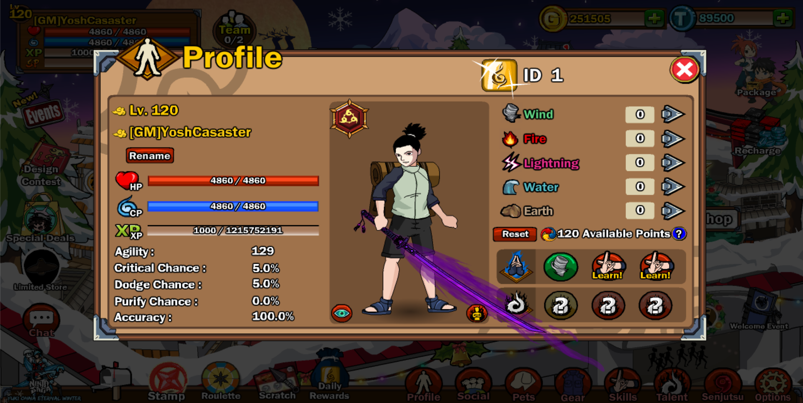

<div align="center">

<br/>

<p>
  A complete private server framework for Ninja Saga — featuring a custom client, live PvP, real-time chat, clan/crew systems, and a powerful admin panel.
</p>

<br/>


</div>

---

## 📋 Table of Contents

- [Branch Status](#-branch-status)
- [Requirements](#-requirements)
- [Setup Guide](#-setup-guide)
  - [1. Install Laragon](#1-install-laragon)
  - [2. Place Server Files](#2-place-the-server-files)
  - [3. Configure Virtual Hosts](#3-configure-virtual-hosts)
  - [4. Update Hosts File](#4-update-the-windows-hosts-file)
  - [5. Configure Laravel](#5-configure-the-laravel-environment)
  - [6. Install PHP Dependencies](#6-install-php-dependencies)
  - [7. Create the Database](#7-create-the-database)
  - [8. Chat Server](#8-set-up-the-chat-server)
  - [9. PvP Server](#9-set-up-the-pvp-server)
- [Running All Servers](#-running-all-servers)
- [Launching the Game](#-launching-the-game)
- [Custom Client Tools](#-custom-client-tools)
- [Artisan Commands](#-useful-artisan-commands)
- [Special Features](#-special-features)
- [Modding Guide](#-customizing--modding-game-data)
- [Contributors](#-contributors)

---

## 🌿 Branch Status

<table>
<tr>
<td width="50%">

### 🟢 `main` — Stable
> **Recommended for most users**

- ✅ Fully tested and verified
- 🔒 Only updated with stable features
- 🎯 Best for running a reliable server

</td>
<td width="50%">

### 🧪 `dev` — Development
> **Bleeding edge, but may break**

- 🧩 New features and experiments
- ⚠️ May contain bugs or breaking changes
- 🔄 Updated frequently

</td>
</tr>
</table>

---

## 📦 Requirements

| Tool | Version | Download |
|------|---------|----------|
| **Laragon** | Latest | [laragon.org](https://laragon.org/download) |
| **PHP** | 8.4+ | Included in Laragon |
| **Composer** | Latest | [getcomposer.org](https://getcomposer.org) |
| **Node.js + npm** | 18+ | [nodejs.org](https://nodejs.org) |
| **Git** | Latest | [git-scm.com](https://git-scm.com) |

---

## 🚀 Setup Guide

### 1. Install Laragon

Download and install [Laragon](https://laragon.org/download). The default install path is `C:\laragon`.

Start Laragon and make sure **Apache** and **MySQL** are both running.

---

### 2. Place the Server Files

Copy the `Database/Laragon/ninjasage` folder into Laragon's web root:

```
C:\laragon\www\ninjasage\
```

Your folder structure should look like:

```
C:\laragon\www\ninjasage\
  ├── app\
  ├── config\
  ├── database\
  ├── public\
  ├── chat-server\
  ├── pvp-server\
  └── ...
```

---

### 3. Configure Virtual Hosts

Copy the config files from `Database/apache2 sites/` into Laragon's Apache vhosts folder:

```
C:\laragon\etc\apache2\sites-enabled\
```

Files to copy:

```
├── 00-default.conf
├── auto.ninjasage.test.conf
├── clan.ninjasage.id.conf
└── crew.ninjasage.id.conf
```

#### 🔐 Copy the SSL Certificates

The `clan` and `crew` vhosts use per-domain SSL certificates. Copy all four files from `Database/etc/ssl/` into:

```
C:\laragon\etc\ssl\
```

```
├── clan.ninjasage.id.pem
├── clan.ninjasage.id-key.pem
├── crew.ninjasage.id.pem
└── crew.ninjasage.id-key.pem
```

Then enable SSL: right-click the **Apache** entry in Laragon → **SSL → Enable**. Laragon will restart Apache automatically.

> **⚠️ Troubleshooting:** If Apache fails to start after copying vhost configs with the error `Cannot access directory .../ninjasage/logs/`, create the logs folder manually:
> ```
> C:\laragon\www\ninjasage\logs\
> ```

---

### 4. Update the Windows Hosts File

Open `C:\Windows\System32\drivers\etc\hosts` **as Administrator** and add:

```
127.0.0.1 ninjasage.test       # laragon magic!
127.0.0.1 clan.ninjasage.id
127.0.0.1 crew.ninjasage.id
```

The main site will be available at: **`https://ninjasage.test`**

---

### 5. Configure the Laravel Environment

Inside `C:\laragon\www\ninjasage\`, copy and edit the env file:

```bash
cp .env.example .env
```

```env
APP_NAME=NinjaSage
APP_URL=https://ninjasage.test

DB_CONNECTION=mysql
DB_HOST=127.0.0.1
DB_PORT=3306
DB_DATABASE=ninjasage
DB_USERNAME=root
DB_PASSWORD=

CHAT_ADMIN_SECRET=your_secret_here
```

> By default, Laragon's MySQL uses `root` with no password.
> Make sure Laragon is using **PHP 8.4+** (switchable from the tray menu).

---

### 6. Install PHP Dependencies

Open a terminal in `C:\laragon\www\ninjasage\` and run:

```bash
composer install
php artisan key:generate
```

> **⚠️ Troubleshooting — lock file error:**
> ```
> Your lock file does not contain a compatible set of packages. Please run composer update.
> ```
> Enable the `zip` extension in your active `php.ini`:
> ```ini
> ; Before
> ;extension=zip
>
> ; After
> extension=zip
> ```
> Save the file, restart Laragon, then run `composer install` again.

---

### 7. Create the Database

```bash
mysql -u root -e "CREATE DATABASE ninjasage;"
php artisan migrate
php artisan db:seed
```

Verify the admin panel is working:

```
https://ninjasage.test/admin/login
```

| Field    | Value              |
|----------|--------------------|
| Email    | `admin@admin.test` |
| Password | `admin`            |

---

### 8. Set Up the Chat Server

```bash
cd C:\laragon\www\ninjasage\chat-server
npm install
cp .env.example .env
```

```env
PORT=3002
DB_HOST=127.0.0.1
DB_PORT=3306
DB_NAME=ninjasage
DB_USER=root
DB_PASS=
CHAT_ADMIN_SECRET=your_secret_here
```

> `CHAT_ADMIN_SECRET` must match the value in your Laravel `.env`.

```bash
npm start
```

Expected output:

```
[Chat] Flash socket policy server listening on port 843
[MessageStore] chat_messages table ready
[Chat] Socket.IO server listening on port 3002
[Chat] Namespaces: /global-chat, /clan-chat
```

---

### 9. Set Up the PvP Server

```bash
cd C:\laragon\www\ninjasage\pvp-server
npm install
cp .env.example .env
```

```env
PORT=3000
DB_HOST=127.0.0.1
DB_PORT=3306
DB_NAME=ninjasage
DB_USER=root
DB_PASS=
```

```bash
npm start
```

Expected output:

```
[SkillData] loaded 1158 skills, 833 skill-effect entries
[PVP] Socket.IO server listening on port 3000
[PVP] Namespace: /pvp
[PVP] Turn duration: 30s
[PVP] Max rounds: 50
```

> The chat and PvP servers are **optional** — the main server works without them, but those features won't be functional.

---

## ▶️ Running All Servers

You need three things running simultaneously:

| Service        | How to Start                      | Port   |
|----------------|-----------------------------------|--------|
| Apache + MySQL | Laragon tray → **Start All**      | `80`   |
| Chat Server    | `npm start` in `chat-server\`     | `3002` |
| PvP Server     | `npm start` in `pvp-server\`      | `3000` |

---

## 🎮 Launching the Game

Run `NSCUSTOM.exe` from `Custom Client/NS Custom Client V1/`.

**Default game login:**

| Field    | Value   |
|----------|---------|
| Username | `Admin` |
| Password | `Admin` |

**Admin panel:**

```
https://ninjasage.test/admin
```

| Field    | Value              |
|----------|--------------------|
| Email    | `admin@admin.test` |
| Password | `admin`            |

---

## 🛠️ Custom Client Tools

Python tools in the `QoL Tools/` folder:

| Script | Description |
|--------|-------------|
| `CustomClientBuilder.py` | Builds the client package |
| `ninjasage_patcher.py` | Patches the SWF to point to your server |
| `gamedata_converter.py` | Converts game data files |

---

## 💻 Useful Artisan Commands

```bash
php artisan tinker
```

See `Database/Laragon/ninjasage/Documentation/Commands.txt` for example commands to add items, skills, pets, and more to characters.

---

## ⭐ Special Features

Replay Ninja exams by setting your character level to one of the following:

| Exam Type           | Level |
|---------------------|-------|
| Chunin Exam         | `101` |
| Jounin Exam         | `102` |
| Special Jounin Exam | `103` |
| Tutor Exam          | `104` |

---

## 🧩 Customizing & Modding Game Data

> Ingin menambahkan Senjata baru, Jutsu, Pet, atau membuat Misi Custom? Semua arsitektur Master Data Ninja Saga tersimpan dalam file `.json` yang harus diubah ke bentuk Binary (`.bin`) agar bisa dibaca oleh Game Engine (Flash).

### Recommended Tools

| Tool | Purpose |
|------|---------|
| **Python 3.x** | Running the compiler/patcher scripts |
| **VS Code / Notepad++** | Safely editing JSON files with syntax highlighting |
| **FFDec (JPEXS)** | Decompiling `.swf` files (sounds, images, animations) |
| **HeidiSQL / DBeaver / PHPMyAdmin** | Syncing JSON modifications to MySQL |

### Steps to Add New Items or Missions

1. Open `public/game_data/` in your project
2. Edit the relevant JSON file:
   - `library.json` → Weapons/Items
   - `mission.json` → Quests/Missions
   - `enemy.json` → Enemies
3. Add a new JSON block following the original Ninja Saga schema
4. Open a terminal in the `public/` folder and run:

```bash
# Linux / Mac
python convert_cli.py

# Windows (Laragon)
py convert_cli.py
```

5. The script will compile `*.json` → encrypted `*.bin` files instantly
6. Place `.swf` graphics into `public/items/` or `public/enemy/` depending on the endpoint
7. Reload the game — your changes are live! 🎉

---

## 👥 Contributors

<div align="center">

| Role | Profile |
|------|---------|
| 👑 **Project Author** | [](https://github.com/YoshCasaster) |
| 💡 **Inspiration** | [](https://github.com/Nik-Potokar) |

</div>

---

<div align="center">

**Made with ❤️ for the Ninja Saga community**

*"The path of the ninja is long — but with a private server, at least you control the respawn."*

</div>
